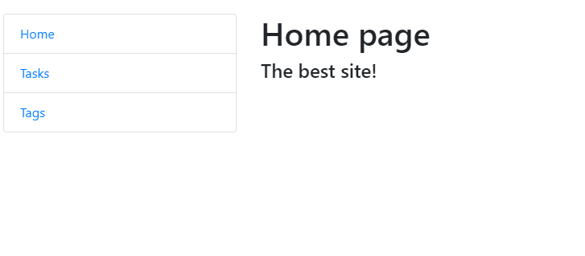
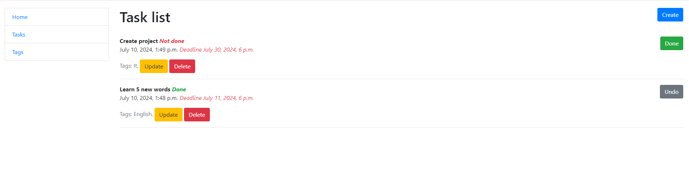
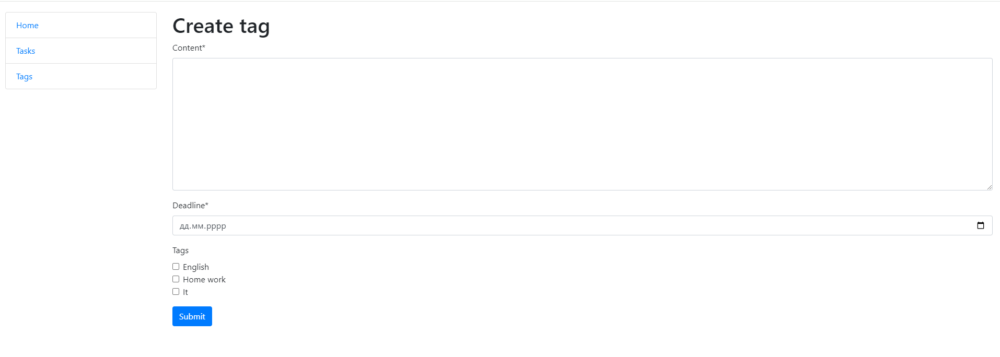
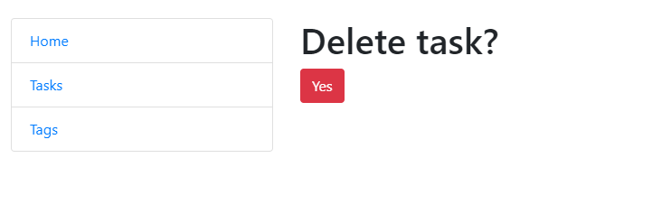
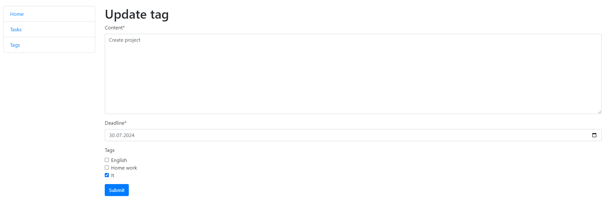
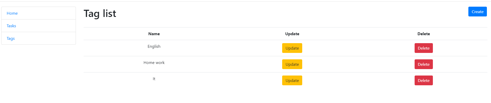

# Todo site

## Overview
This program is a simple web application for managing a list of tasks (todo list). It allows users to create, view, update, and delete tasks, as well as tag them for better organization and categorization.

# Home page

# Task list page

# Create page

# Delete page

# Update page

# Tag list page

